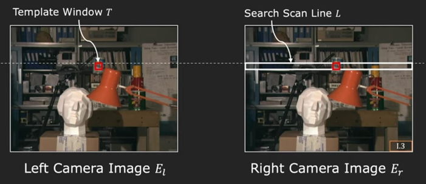
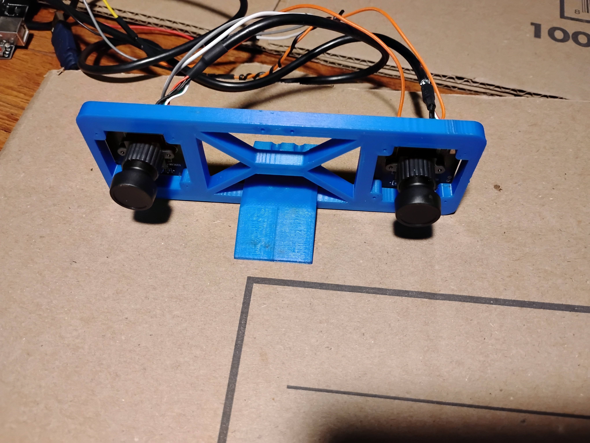
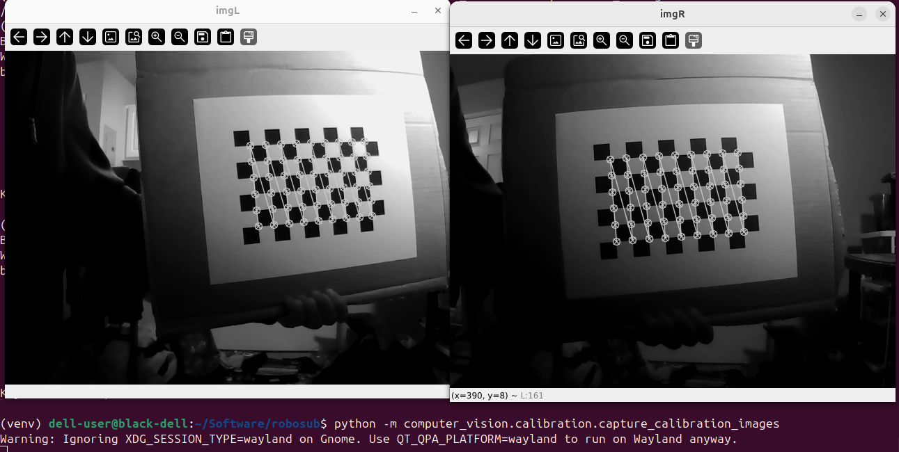
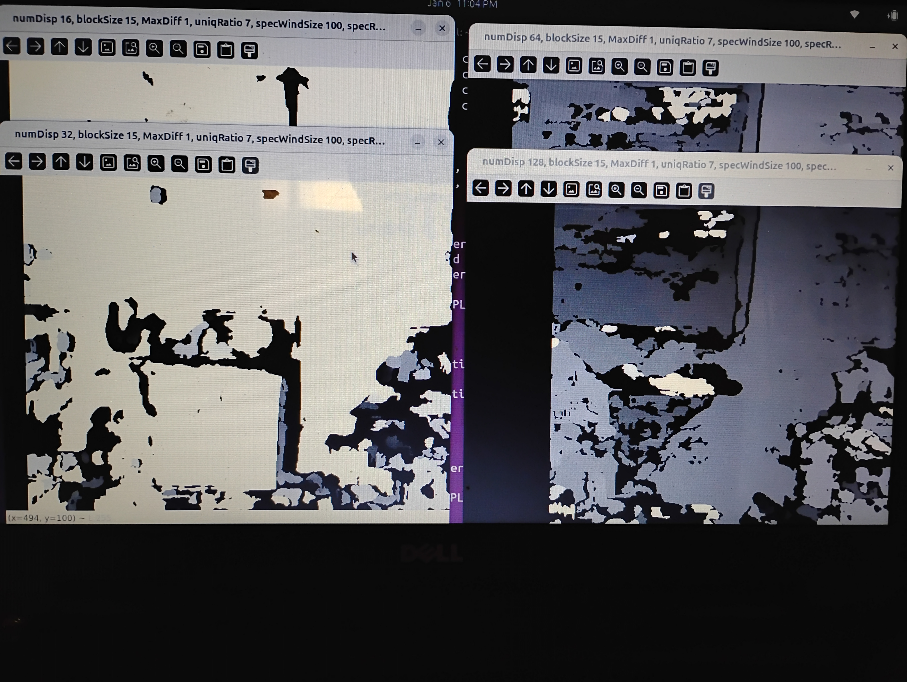

# See finalized version with full README documentation at [RoboSub](https://github.com/hornet-robotics/robosub)

Implementation of stereo depth perception. First implementation used Python with minimal OpenCV and Numpy to become involved with the entire
implemenation process. Second implementation leverage more OpenCV functions for greater performance and optimization. 

# Demo of Disparity Map
[Screencast from 2026-01-03 16-42-22.webm](https://github.com/user-attachments/assets/c0932cb7-2033-43f2-8a20-b8de5cfe7a81)

# How It Works

    

Two independent cameras are synchronized to capture an image at the same time. These images are compared for corresponding pixel groups. 
A pixel window in one image is matched to a pixel window of the other image. The shift is measured and used to calculate disparity and depth. 
Before comparing images, the cameras need to be calibrated to ensure practical comparison between the captured images. 

# Hardware
Tested using Inno-Maker U20CAM which allows for external image capture triggering. Trigger timing was handled by an Arduino. 

    

# Calibration Script
A calibration script was created to capture the intrinsic and extrinsic parameters of the cameras. 

    

# Parameter Tuning Script
A parameter tuning script was created to faciliate parameter tuning to better disparity map results. Parameters
included window size and number of pixels to search. 

    

#### Reference comands:
sudo guvcview
v4l2-ctl --list-devices
v4l2-ctl -d /dev/video0 --list-ctrls

vids for stereo vision
https://www.youtube.com/watch?v=S-UHiFsn-GI&list=PL2zRqk16wsdoCCLpou-dGo7QQNks1Ppzo&index=1

vids for eigen vectors
https://www.youtube.com/watch?v=PFDu9oVAE-g&t=490s
https://www.youtube.com/watch?v=TQvxWaQnrqI
